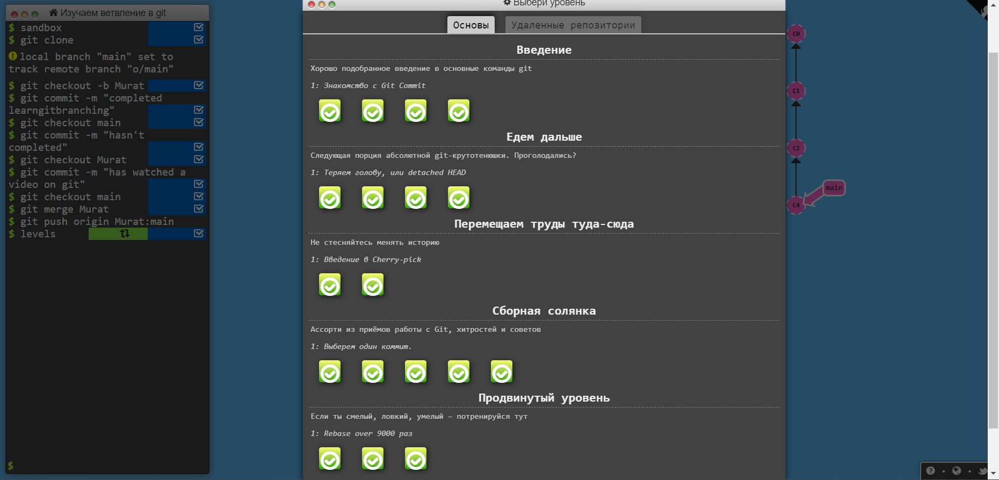
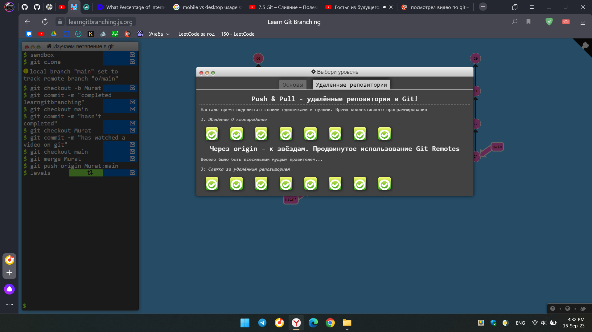

# FinTech
***Решил сделать README.MD в виде dropdown списков***

<details> <summary>Пройти интерактивный курс по git</summary>

Пруфы прохождения интерактивного курса по [git](https://learngitbranching.js.org/?locale=ru_RU):


</details>

<details> <summary>Создать репозиторий на GitHub</summary> 

На GitHub был создан пустой репозиторий под названием [fintech](https://github.com/TblPK/fintech/)
</details>

<details> <summary>Создать ветку и запушить ветку master</summary>

С помощью следующих команд была создана и запушена ветка master на удаленный репозиторий (он же GitHub):
```
git init
git commit --allow-empty -m "--allow-empty"
git remote add origin https://github.com/TblPK/fintech.git
git push -u origin master
```
</details>

<details> <summary>Создать ветку develop</summary>

Чтобы создать ветку и сразу переключиться на неё, можно выполнить команду: `git checkout -b develop`
</details>

<details> <summary>Опыт, какие навыки имеете</summary>

У меня нет огромного опыта разработки. В основном я занимался созданием мелких приложений для изучения различных языков программирования (Java, C++, Python, Kotlin, ~~MatLab~~). 

Из более-менее серьезных проектов:
- Курсовая работа: реализация функциональности сохранения отрисовываемых на сцене объектов в приложении на Android с использованием Java. (репозиторий приватный)
- Делал для себя: реализация простого клиент-серверного приложения на чистой Java [GitHub](https://github.com/TblPK/client-server-application).

Kotlin был выбран для изучения алгоритмов и структур данных, ну и для решения задач на LeetCode.
</details>

<details> <summary>Цели, что хотите получить от курса</summary>

Как уже было написано в анкете: надеюсь, что обучение позволит мне получить фундаментальные знания и навыки, необходимые для успешной карьеры в области разработки программного обеспечения. Будучи оснащенным этими навыками, я смогу выполнять сложные задачи, создавать инновационные проекты и продвигаться в своей профессиональной сфере.
</details>

<details> <summary>Какой бы курсовой проект хотели бы реализовать (если уже определились), если не определились мы поможем вам с выбором</summary>

Пока еще не определился с курсовым проектом :)
</details>

<details> <summary>Опишите основные команды git, как ими пользоваться и напишите пример использования</summary>

Образно команды git можно разделить на следующие типы:

<u>1. Команды управления репозиторием</u>:
- `git init`: инициализирует новый репозиторий Git в текущем каталоге.
- `git clone`: клонирует существующий репозиторий Git на локальную машину.
- `git remote`: управляет удаленными репозиториями, связанными с локальным.
- `git config`: устанавливает или просматривает конфигурационные параметры.

<u>2. Команды управления изменениями</u>:
- `git add`: индексирует изменения для коммита.
- `git commit`: создает новый коммит с индексированными изменениями.
- `git reset`: позволяет отменить изменения в репозитории.
- `git revert`: создает новый коммит, который отменяет изменения.

<u>3. Команды управления ветками</u>:
- `git branch`: отображает, создает или удаляет ветки.
- `git checkout`: переключается между ветками или восстанавливает файлы.
- `git merge`: сливает изменения из одной ветки в другую.
- `git rebase`: перебазирует текущую ветку на другую ветку.

<u>4. Команды управления удаленными репозиториями</u>:
- `git push`: отправляет локальные коммиты на удаленный репозиторий.
- `git pull`: получает изменения с удаленного репозитория со слиянием.
- `git fetch`: получает изменения с удаленного репозитория без слияния.

<u>5. Команды просмотра истории и состояния</u>:
- `git log`: отображает историю коммитов.
- `git status`: показывает текущее состояние репозитория.
- `git diff`: показывает различия между коммитами, ветками или файлами.
- `git show`: показывает информацию о коммите, внесенные в него.

Пример использования:
+ init: проинициализируем локальный репозиторий.
	- `git init`
+ clone: скопируем наш удаленный репозиторий.
	- `git clone https://github.com/TblPK/fintech`
+ add: проиндексируем файл.
	- `git add README.MD`
+ commit: закоммитим индексированные файлы.
	- `git commit -m "add README.MD"`
+ push: запушим изменения из локальной ветки main в удаленную ветку main.
	- `git push origin main`
+ pull: сольем изменения из удаленной ветки main в локальную ветки main. 
	- `git pull origin main`
</details>

<details> <summary>Добавить коммит с README.MD файлом, где указать информацию о себе</summary>

Мы уже находимся в ветке develop. Теперь проиндексируем файл README.MD и закоммитим.
```
git add README.MD
git commit -m "add README.MD"
```
</details>

